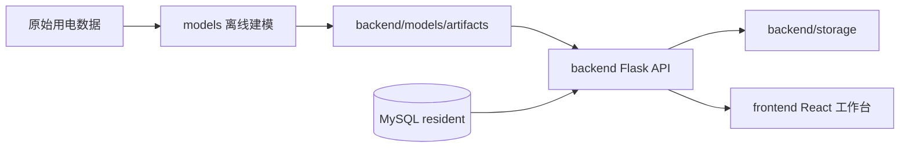

# 居民用电分析与节能建议系统

这是项目根目录的开发者总览。它只负责交代仓库边界、启动顺序、子项目关系和常用命令；更细的接口、模型训练和前端页面说明分别放在各子目录 README 中。

本项目面向居民用电数据，提供数据集管理、用电统计分析、行为分类、异常检测、负荷预测、智能问答和报告导出能力。

## 项目分层

| 子项目 | 职责 | 主要入口 |
| --- | --- | --- |
| `frontend/` | React 前端工作台，负责页面、图表、交互和后端 API 调用 | `pnpm dev` |
| `backend/` | Flask API 服务，负责数据集管理、数据库读写、模型推理、报告生成和智能问答 | `main.py` |
| `models/` | 离线建模工程，负责预处理、训练、评估、对比图和后端推理产物准备 | 各任务目录的 `main.py` |

职责边界要保持清晰：

- 前端只通过 `/api/v1` 请求后端，不直接读取数据库或模型文件。
- 后端加载 `backend/models/artifacts/` 中的稳定模型产物，不直接依赖 `models/**/output/`。
- `models/` 可以产生实验结果和训练输出，但只有整理后的稳定产物才同步给后端。

## 架构概览



典型运行链路是：先用 `models/` 训练或准备模型产物，再由 `backend/` 加载产物并提供接口，最后由 `frontend/` 展示数据集、分析结果和模型结果。

## 目录结构

```text
.
├── backend/             Flask API、数据库访问、模型推理、报告生成
├── frontend/            React + Vite + TypeScript 前端工作台
├── models/              离线数据预处理、训练、评估、可视化
├── docker-compose.yml   可选的本地 MySQL 容器配置
├── schema.sql           MySQL 表结构初始化脚本
└── README.md            项目总入口
```

## 本地启动顺序

### 1. 准备 MySQL

项目真正依赖的是 MySQL，不依赖 Docker。生产或长期开发环境更建议自行安装 MySQL，并在 `backend/.env` 中配置真实连接信息。

推荐准备方式：

```sql
CREATE DATABASE resident CHARACTER SET utf8mb4 COLLATE utf8mb4_unicode_ci;
```

然后在项目根目录执行初始化脚本：

```bash
mysql -u root -p resident < schema.sql
```

如果只是本地快速启动，也可以使用仓库里的 `docker-compose.yml`。这是为了减少环境配置成本，不是项目运行的强制要求：

在项目根目录执行：

```bash
docker compose up -d
```

Docker 方案默认配置：

| 配置项 | 默认值 |
| --- | --- |
| MySQL 镜像 | `mysql:8.0` |
| 数据库名 | `resident` |
| root 密码 | `root` |
| 本地端口 | `3306` |
| 数据目录 | `mysql_data/` |
| 初始化脚本 | `schema.sql` |

`mysql_data/` 是 Docker MySQL 的本地持久化目录，不应提交到 Git。MySQL 官方镜像只会在数据目录首次初始化时执行 `schema.sql`；如果表结构没有生效，先确认 `mysql_data/` 是否已经存在旧数据。

### 2. 启动后端

```bash
cd backend
cp .env.example .env
uv sync
uv run python main.py
```

后端默认监听：

```text
http://127.0.0.1:5000
```

业务接口默认挂载在：

```text
/api/v1
```

本地密钥、数据库连接、LLM 配置和运行时开关只写入 `backend/.env`。

### 3. 启动前端

```bash
cd frontend
pnpm install
pnpm dev
```

前端默认监听：

```text
http://127.0.0.1:3000
```

开发环境中，Vite 会把 `/api` 请求代理到 `VITE_BACKEND_BASE_URL`。默认后端地址来自 `frontend/.env.example`：

```text
VITE_BACKEND_BASE_URL=http://127.0.0.1:5000
VITE_API_PREFIX=/api/v1
```

### 4. 可选：运行离线模型任务

`models/` 不属于前后端日常启动链路，通常在需要重新训练、评估或准备推理产物时运行。

```bash
cd models
uv sync
uv run python data/classification/preprocess_classification.py
uv run python classification/kmeans/main.py
uv run python classification/xgboost/main.py
```

预测、异常检测和五模型对比的完整命令见 [models/README.md](models/README.md)。

## 常用命令

| 场景 | 命令 |
| --- | --- |
| 可选：用 Docker 启动 MySQL | `docker compose up -d` |
| 启动后端 | `cd backend && uv run python main.py` |
| 后端健康检查 | `curl http://127.0.0.1:5000/api/v1/health` |
| 后端语法检查 | `cd backend && uv run python -m compileall -q -f app models config.py main.py` |
| 启动前端 | `cd frontend && pnpm dev` |
| 前端 lint | `cd frontend && pnpm lint` |
| 构建前端 | `cd frontend && pnpm build` |
| 同步模型环境 | `cd models && uv sync` |
| 模型语法检查 | `cd models && uv run python -m compileall -q -f main.py data classification detection forecast` |

## 端口和配置

| 服务 | 默认地址 | 说明 |
| --- | --- | --- |
| 前端 | `http://127.0.0.1:3000` | Vite dev server |
| 后端 | `http://127.0.0.1:5000` | Flask API |
| MySQL | `127.0.0.1:3306` | `resident` 数据库 |

配置文件约定：

| 位置 | 用途 |
| --- | --- |
| `backend/.env.example` | 后端环境变量模板 |
| `backend/.env` | 后端本地真实配置，不提交 |
| `frontend/.env.example` | 前端开发代理和 API 前缀模板 |
| `schema.sql` | MySQL 表结构初始化脚本 |
| `docker-compose.yml` | 可选的本地 MySQL 容器配置 |

## 数据与产物

| 路径 | 内容 | 是否作为源码提交 |
| --- | --- | --- |
| `backend/storage/` | 上传文件、标准化数据、分析结果、预测结果、报告文件 | 否 |
| `backend/models/artifacts/` | 后端推理需要的稳定模型文件和配置 | 视文件大小和交付要求决定 |
| `models/data/**/output/` | 离线预处理中间数据 | 否 |
| `models/classification/**/output/` | 分类训练输出 | 否 |
| `models/detection/**/output/` | 异常检测输出 | 否 |
| `models/forecast/**/output/` | 预测模型 checkpoint、指标、图表 | 否 |
| `models/_result_backups/` | 历史实验备份 | 否 |

从模型训练到后端推理的关系：

1. 在 `models/` 中完成预处理、训练和评估。
2. 选出后端真正需要的模型文件、编码器、阈值和特征配置。
3. 同步到 `backend/models/artifacts/`。
4. 后端服务启动或调用推理接口时加载这些稳定产物。

## 子项目文档

| 文档 | 建议阅读场景 |
| --- | --- |
| [backend/README.md](backend/README.md) | 修改接口、服务层、模型推理、报告导出、LangChain 智能问答 |
| [frontend/README.md](frontend/README.md) | 修改页面、路由、图表、API 调用、前端构建 |
| [models/README.md](models/README.md) | 重新训练模型、生成对比图、同步后端 artifacts |

## 开发约定

- Python 子项目优先使用 `uv` 管理依赖和运行命令。
- Node.js 子项目使用 `pnpm`，不要使用 `npm` 生成依赖锁文件。
- 不提交 `.env`、`node_modules/`、`dist/`、本地虚拟环境、数据库目录和运行缓存。
- 不把大型训练数据、checkpoint、实验备份直接提交到 Git。
- 新增后端接口时，优先把复杂逻辑放到 `backend/app/services/`，路由层只做参数读取和响应封装。
- 新增模型任务时，优先沿用 `main.py`、`config.py`、`data.py`、`model.py`、`train.py`、`test.py` 的目录组织方式。
- 新增前端页面时，路由入口放在 `src/pages/`，复杂业务拆到 `src/features/`。

## 最小自检清单

提交前按改动范围选择执行：

| 改动范围 | 建议自检 |
| --- | --- |
| 后端代码 | `cd backend && uv run python -m compileall -q -f app models config.py main.py` |
| 后端接口联调 | 启动服务后执行 `curl http://127.0.0.1:5000/api/v1/health` |
| 前端代码 | `cd frontend && pnpm lint && pnpm build` |
| 模型代码 | `cd models && uv run python -m compileall -q -f main.py data classification detection forecast` |
| README 或文档 | 检查命令、端口、路径是否和实际配置一致 |

如果本地缺少 `uv`、`pnpm` 或 MySQL，不要在项目目录里临时混用其他包管理器；先补齐环境，再按上面的命令运行。Docker 只是可选的 MySQL 管理方式，可以不用。
