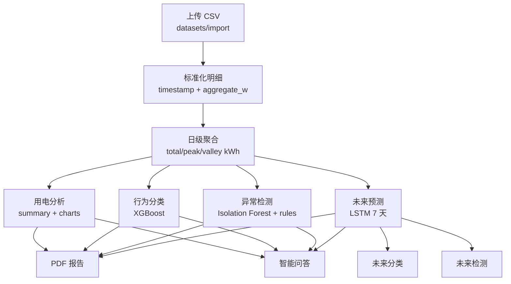

# backend Flask API 服务

`backend/` 是项目的接口服务层，负责接收前端请求、管理数据集、调用模型推理、生成报告、保存运行产物，并把结果写入数据库。

和 `models/` 的职责边界：

- `models/`：离线训练、实验、评估，产出模型文件和特征配置。
- `backend/`：加载稳定模型产物，执行在线推理和业务接口，不直接读取 `models/**/output/`。

## 运行入口

开发环境直接运行：

```bash
cd backend
uv run python main.py
```

`main.py` 是 Flask 开发入口，内部调用：

```python
app = create_app(Config)
```

实际应用组装逻辑在 `app/__init__.py`：

1. 加载 `Config`
2. 初始化 CORS 和 SQLAlchemy
3. 创建 `storage/` 运行目录
4. 注册请求日志和统一错误处理
5. 注册所有业务蓝图

## 环境初始化

```bash
cd backend
cp .env.example .env
uv sync
```

后端只要求能连接到 MySQL。更稳定的方式是自行安装 MySQL，创建 `resident` 数据库，并从项目根目录执行初始化脚本：

```sql
CREATE DATABASE resident CHARACTER SET utf8mb4 COLLATE utf8mb4_unicode_ci;
```

```bash
mysql -u root -p resident < schema.sql
```

如果只是本地快速开发，也可以在项目根目录使用 Docker 启动 MySQL。这个方式只是为了省去安装和配置成本，不是后端的强制依赖：

```bash
docker compose up -d
```

无论使用本机 MySQL 还是 Docker MySQL，后端最终都通过 `backend/.env` 中的 `DB_HOST`、`DB_PORT`、`DB_USER`、`DB_PASSWORD`、`DB_NAME` 连接数据库。表结构初始化脚本以项目根目录的 `schema.sql` 为准。

## 常用命令

```bash
# 启动 Flask 开发服务
uv run python main.py

# 只做源码语法检查
uv run python -m compileall -q -f app models config.py main.py

# 健康检查，服务启动后执行
curl http://127.0.0.1:5000/api/v1/health
```

## 技术栈

| 类型 | 选型 |
| --- | --- |
| Web 框架 | Flask |
| ORM | Flask-SQLAlchemy |
| 数据库 | MySQL + PyMySQL |
| 数据处理 | NumPy、Pandas |
| 模型推理 | scikit-learn、XGBoost、PyTorch |
| 智能问答 | LangChain、OpenAI 兼容接口 |
| 报告生成 | Markdown、ReportLab PDF |
| 依赖管理 | uv |

## 目录结构

```text
backend/
├── main.py                     # Flask 开发入口
├── config.py                   # 环境变量和默认配置
├── app/
│   ├── __init__.py             # create_app 应用工厂
│   ├── api.py                  # 统一响应、request_id、错误处理、请求日志
│   ├── models.py               # SQLAlchemy 数据模型
│   ├── extensions.py           # Flask 扩展实例
│   ├── errors.py               # 业务异常类型
│   ├── routes/                 # Flask 蓝图，只接收参数和返回响应
│   ├── services/               # 业务逻辑：数据、模型、报告、Agent
│   └── tools/
│       └── md2pdf.py           # Markdown 转 PDF 工具
├── models/                     # 后端推理适配层
│   ├── classification.py
│   ├── detection.py
│   ├── forecast.py
│   ├── lstm_model.py
│   └── artifacts/              # 后端加载的稳定模型产物
├── storage/                    # 本地运行产物，启动时自动创建
├── pyproject.toml
└── uv.lock
```

## 请求与响应约定

所有业务接口默认挂载在：

```text
/api/v1
```

前缀由 `.env` 或 `Config.API_PREFIX` 控制。

所有 JSON 响应统一使用 envelope：

```json
{
  "code": "OK",
  "message": "success",
  "data": {},
  "request_id": "xxx",
  "timestamp": "2026-05-24T..."
}
```

`request_id` 同时写入响应头：

```text
X-Request-ID: xxx
```

开发接口时不要直接返回裸 JSON，统一使用 `app.api.success()` 或抛出 `AppError` 子类。

## API 模块

| 模块 | 主要接口职责 |
| --- | --- |
| `routes/health.py` | 健康检查，检查数据库、模型产物和 LLM 配置 |
| `routes/system.py` | 运行时系统配置读取和更新 |
| `routes/datasets.py` | CSV 上传、数据集列表、数据集详情 |
| `routes/analysis.py` | 用电统计分析结果 |
| `routes/classifications.py` | 当前窗口和未来窗口行为分类 |
| `routes/detections.py` | 当前窗口异常检测 |
| `routes/forecasts.py` | 未来用电预测和预测详情 |
| `routes/reports.py` | PDF 报告导出、列表、下载 |
| `routes/chat.py` | 聊天会话和消息管理 |
| `routes/agent.py` | 面向数据集的智能问答 |

路由层只做参数读取、调用 service、返回统一响应；不要把数据清洗、模型推理或数据库复杂逻辑写进 route。

## 后端数据流



## 核心业务说明

### 数据集导入

入口：`services/dataset_service.py`

导入流程：

1. 校验上传文件、名称、文件类型
2. 读取 CSV
3. 识别 `timestamp` 和 `aggregate_w`
4. 校验采样粒度，默认接受 1 到 60 分钟
5. 标准化为时间序列明细
6. 聚合为日级 `total_kwh`、`peak_kwh`、`valley_kwh`
7. 写入质量报告、分析结果和数据库记录

后端上传接口面向前端标准文件：

```text
timestamp,aggregate_w
2026-01-01 00:00:00,1234
...
```

### 用电分析

入口：`services/analysis_service.py`

基于标准化明细和日级聚合数据生成：

- 总用电量
- 日均用电量
- 最大/最小负荷和发生时间
- 峰时/谷时用电量
- 峰谷占比
- 日趋势、周趋势、典型日曲线

### 行为分类

入口：

- `services/classification_service.py`
- `models/classification.py`

默认按自然周构造 7 天窗口，提取 16 维行为特征后调用 XGBoost 分类模型。

### 异常检测

入口：

- `services/detection_service.py`
- `models/detection.py`

当前窗口默认使用最近 7 天。检测逻辑结合：

- Isolation Forest 分数
- 统计规则阈值
- 可解释原因列表

### 未来预测

入口：

- `services/forecast_service.py`
- `models/forecast.py`

当前后端推理模型要求：

- 最近 30 天日级历史数据
- 固定预测未来 7 天
- 输出总量、峰时、谷时三组结果

预测完成后会同步生成：

- 未来窗口行为分类
- 未来窗口异常检测

### 报告导出

入口：`services/report_service.py`

流程：

1. 汇总数据集、分析、分类、检测和预测上下文
2. 优先使用 LLM 生成报告摘要
3. LLM 不可用时使用本地 fallback 摘要
4. 生成 Markdown 报告源文件
5. 调用 `app/tools/md2pdf.py` 渲染 PDF
6. 写入 `reports` 表

### 智能问答

入口：`services/agent_service.py`

Agent 不直接读散落文件，而是先构造结构化上下文：

- analysis
- classification
- current_detection
- future_detection
- forecast
- classification_taxonomy

然后通过 LangChain 的 `ChatPromptTemplate` 和 `ChatOpenAI` 调用 OpenAI 兼容接口。LLM 不可用时返回本地规则摘要。

## 关键配置

配置集中在 `config.py`，运行时从 `.env` 读取。

| 变量 | 默认值 | 说明 |
| --- | --- | --- |
| `APP_HOST` | `0.0.0.0` | Flask 监听地址 |
| `APP_PORT` | `5000` | Flask 监听端口 |
| `API_PREFIX` | `/api/v1` | API 前缀 |
| `DB_HOST` | `127.0.0.1` | MySQL 地址 |
| `DB_PORT` | `3306` | MySQL 端口 |
| `DB_NAME` | `resident` | 数据库名 |
| `STORAGE_ROOT` | `backend/storage` | 运行产物根目录 |
| `MAX_CONTENT_LENGTH_MB` | `20` | 上传文件大小限制 |
| `CLASSIFICATION_DAYS` | `7` | 分类窗口天数 |
| `DETECTION_DAYS` | `7` | 检测窗口天数 |
| `FORECAST_HISTORY_DAYS` | `30` | 预测历史窗口 |
| `FORECAST_HORIZON_DAYS` | `7` | 预测未来天数 |
| `ACCEPTED_MIN_GRANULARITY_MINUTES` | `1` | 接受的最小采样粒度 |
| `ACCEPTED_MAX_GRANULARITY_MINUTES` | `60` | 接受的最大采样粒度 |

LLM 相关：

| 变量 | 说明 |
| --- | --- |
| `LLM_BASE_URL` | OpenAI 兼容服务地址 |
| `LLM_API_KEY` | API Key |
| `LLM_MODEL` | 模型名 |
| `LLM_TEMPERATURE` | 生成温度 |
| `LLM_TIMEOUT_SECONDS` | 普通问答超时 |
| `LLM_REPORT_TIMEOUT_SECONDS` | 报告生成超时 |

密钥只写入本地 `.env`，不要提交到仓库。

## 运行产物目录

`create_app()` 会自动创建这些目录：

| 目录 | 说明 |
| --- | --- |
| `storage/uploads/` | 原始上传文件 |
| `storage/normalized/` | 标准化时间序列 |
| `storage/daily/` | 日级聚合数据 |
| `storage/quality/` | 数据质量报告 |
| `storage/analysis/` | 分析结果 JSON |
| `storage/forecasts/` | 预测结果 JSON |
| `storage/reports_md/` | Markdown 报告源文件 |
| `storage/reports/` | PDF 报告 |

这些目录是本地运行数据，不作为源码提交。

## 模型产物

后端默认从这里加载模型产物：

```text
backend/models/artifacts/
```

当前约定：

```text
backend/models/artifacts/
├── classification/
│   └── xgboost/
│       ├── xgboost_model.json
│       └── label_encoder.pkl
├── detection/
│   ├── isolation_forest/
│   │   └── isolation_forest.pkl
│   └── statistical_rules/
│       └── rule_thresholds.json
└── forecast/
    └── lstm/
        ├── checkpoints/best.ckpt
        ├── input_scalers.npz
        └── feature_columns.json
```

如果离线训练产物变化，需要同步检查：

- `backend/models/classification.py`
- `backend/models/detection.py`
- `backend/models/forecast.py`
- `backend/models/lstm_model.py`

## 数据库模型

主要表在 `app/models.py`：

| 模型 | 说明 |
| --- | --- |
| `Dataset` | 数据集主表，保存上传文件、处理状态、产物路径 |
| `AnalysisResult` | 用电统计分析结果 |
| `ForecastResult` | 预测任务记录和预测明细路径 |
| `ClassificationResult` | 当前/未来窗口分类结果 |
| `DetectionResult` | 当前/未来窗口异常检测结果 |
| `ChatSession`、`ChatMessage` | 智能问答会话与消息 |
| `Report` | PDF 报告文件记录 |

## 开发约定

- 新增接口先放到 `routes/`，业务逻辑放到 `services/`。
- route 不做复杂业务，只接参数、调 service、返回统一响应。
- service 可以读写数据库、文件和模型推理结果。
- 后端推理适配代码放在 `backend/models/`，不要直接导入 `models/` 离线训练工程。
- 所有新响应保持 envelope 结构。
- 业务错误使用 `AppError`、`NotFoundError`、`ValidationError`、`ServiceUnavailableError`。
- 运行时文件写入 `storage/` 或明确 ignored 的目录。
- 修改模型产物格式时，同时更新后端加载逻辑和本 README。

## 最小自检清单

改后端代码后至少运行：

```bash
cd backend
uv run python -m compileall -q -f app models config.py main.py
```

如果改了接口启动流程，再运行：

```bash
uv run python main.py
```

然后访问：

```bash
curl http://127.0.0.1:5000/api/v1/health
```
