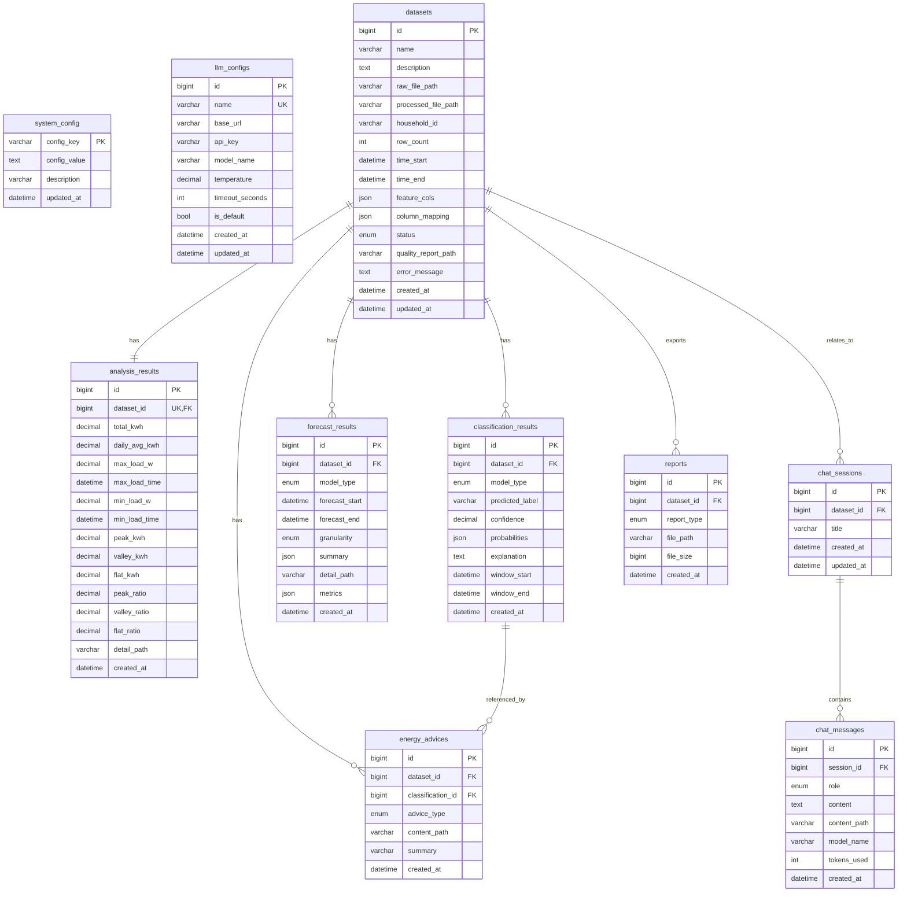

# 数据库设计文档

> 项目：居民用电分析与节能建议系统  
> 数据库：MySQL 8.0  
> 数据库名：`resident`  
> 对应建表脚本：[schema.sql](./schema.sql)

---

## 1. 设计目标

本数据库面向“单用户、本地部署”的毕业设计系统，服务于以下核心链路：

1. 数据集导入、清洗、管理
2. 统计分析结果存储
3. 行为分类与时序预测结果存储
4. 节能建议、智能问答、导出报告记录

数据库只存**结构化元数据**与**查询高频字段**；原始数据、详细曲线、模型权重、长文本、报告文件等大对象统一存文件系统，数据库中仅保存路径。

---

## 2. 设计原则

### 2.1 单用户本地化

- 不设计多租户和复杂权限体系
- 系统级配置统一放入 `system_config`
- 无需登录认证，零登录设计

### 2.2 元数据入库，大对象落盘

以下内容不直接存数据库正文：

- 原始上传文件
- 清洗后的数据文件
- 数据质量报告
- 统计分析详情 JSON
- 预测序列文件
- 节能建议正文文件
- 导出报告文件
- 长聊天消息

这样做的目的：

- 降低数据库体积和备份压力
- 避免大字段频繁读写拖慢主流程
- 让数据库专注承担“索引、检索、关联、状态管理”

### 2.3 主流程实体清晰拆分

- `datasets` 是全系统主实体
- 统计分析采用单结果表 `analysis_results`
- 分类、预测结果分别独立建表
- 智能问答分成会话表和消息表
- 节能建议与导出报告独立管理

### 2.4 约束前置

对于容易出错的关键字段，在数据库层增加约束：

- 时间范围不能倒置
- 置信度、占比必须在合法区间
- 聊天消息必须至少有正文或文件路径
- 统计分析每个数据集只保留一份当前结果

### 2.5 删除策略清晰

- 删除数据集时，其分析结果、分类结果、预测结果、建议、报告一并级联删除
- 聊天会话与数据集解绑而不是硬删，会话保留但 `dataset_id = NULL`

---

## 3. 数据库整体结构

当前数据库共 10 张表：

1. `system_config`：系统配置
2. `llm_configs`：LLM 配置
3. `datasets`：数据集主表
4. `analysis_results`：统计分析结果
5. `classification_results`：行为分类结果
6. `forecast_results`：时序预测结果
7. `chat_sessions`：聊天会话
8. `chat_messages`：聊天消息
9. `energy_advices`：节能建议
10. `reports`：导出报告

### 3.1 关系总览

- `datasets` 是核心业务主表
- `analysis_results` 与 `datasets` 是 1:1
- `classification_results`、`forecast_results`、`energy_advices`、`reports` 与 `datasets` 是 1:N
- `chat_sessions` 与 `datasets` 是可选关联
- `chat_messages` 与 `chat_sessions` 是 1:N
- `energy_advices` 可选关联到某条 `classification_results`

### 3.2 文字结构图

```text
system_config
llm_configs

datasets
├── analysis_results         (1:1)
├── classification_results   (1:N)
│   └── energy_advices       (0..N，可选按分类结果挂接)
├── forecast_results         (1:N)
├── energy_advices           (1:N)
├── reports                  (1:N)
└── chat_sessions            (0..N，可选)
    └── chat_messages        (1:N)
```

### 3.3 ER 图（Mermaid）

如果你的 Markdown 查看器支持 Mermaid，可以直接渲染：



---

## 4. 表级设计

## 4.1 `system_config`

### 用途

存放系统级 KV 配置。适合存：

- 峰谷时间段规则（JSON 格式）
- 模型历史窗口配置（分类/预测）
- 节能建议智能体提示词模板
- 上传目录
- 报告输出目录
- 默认 LLM 配置 ID

### 关键设计

- 主键使用 `config_key`
- 不单独再建配置明细表，保持简单
- 适用于低频修改、高频读取的全局配置

### 初始化策略

初始化脚本只预置：

- `peak_valley_config`（JSON 格式峰谷时段配置）
- `model_history_window_config`（分类/预测历史窗口配置）
- `energy_advice_prompt_template`（节能建议智能体提示词模板）
- `data_upload_dir`
- `report_output_dir`

`default_llm_id` 不在建库时强行写死，避免引用一个尚不存在的 LLM 配置。

---

## 4.2 `llm_configs`

### 用途

保存 OpenAI-compatible 的 LLM 连接信息。

### 关键字段

- `name`：配置名称，唯一
- `base_url`：接口地址
- `api_key`：密钥
- `model_name`：模型名称
- `temperature`：温度参数
- `timeout_seconds`：超时秒数
- `is_default`：是否默认

### 关键设计

- `name` 加唯一约束，避免同名配置重复
- `temperature` 限制在 `0.00 ~ 2.00`
- `timeout_seconds` 必须大于 0
- `is_default` 是否唯一由应用层保证，数据库只建普通索引

---

## 4.3 `datasets`

### 用途

数据集主表，记录上传、清洗、状态流转和基础元信息，是全系统的核心实体。

### 关键字段

- `raw_file_path`：原始文件路径
- `processed_file_path`：清洗后文件路径
- `feature_cols`：原始特征列名列表
- `column_mapping`：原始列到标准列的映射
- `status`：`uploaded / processing / ready / error`
- `quality_report_path`：质量报告路径

### 关键设计

- 时间范围允许为空，但若都存在则要求 `time_end >= time_start`
- `feature_cols` 与 `column_mapping` 使用 JSON，适配不同来源数据
- 保留 `error_message` 便于导入失败排查

### 状态流转建议

```text
uploaded -> processing -> ready
uploaded -> processing -> error
error -> processing -> ready
```

---

## 4.4 `analysis_results`

### 用途

保存一个数据集当前版本的基础统计分析结果。

### 为什么设计为 1:1

当前系统场景中，统计分析是“对一个数据集生成一份当前结果”，而不是保留多版本历史。因此：

- 对 `dataset_id` 增加唯一约束
- 若重新分析，建议执行覆盖更新或先删后插

### 关键字段

- `total_kwh`
- `daily_avg_kwh`
- `max_load_w` / `min_load_w`
- `peak_kwh` / `valley_kwh` / `flat_kwh`
- `peak_ratio` / `valley_ratio` / `flat_ratio`
- `detail_path`

### 约束

- 用电量和负荷字段必须为非负
- 峰谷平 kWh 必须为非负
- 占比必须在 `0 ~ 1` 之间

### 一致性约束说明

- `peak_kwh` / `valley_kwh` / `flat_kwh` 为主存储值
- `peak_ratio` / `valley_ratio` / `flat_ratio` 由对应 `kwh / total_kwh` 计算得出
- 服务层保证 `peak_kwh + valley_kwh + flat_kwh = total_kwh`
- 服务层保证 `peak_ratio + valley_ratio + flat_ratio ≈ 1.0`（允许浮点误差）
- 当前不在数据库层增加这组一致性约束，避免把业务计算逻辑固化到表约束中

---

## 4.5 `classification_results`

### 用途

保存行为分类推理结果。一个数据集可以有多条分类记录，例如：

- 不同模型各跑一次
- 同一模型对不同时间窗口分别推理
- 未来保留多次实验结果

### 关键字段

- `model_type`：`tcn`
- `predicted_label`
- `confidence`
- `probabilities`
- `explanation`
- `window_start` / `window_end`

### 关键设计

- `predicted_label` 固定使用 4 个稳定英文标识：`day_high_night_low`、`day_low_night_high`、`all_day_high`、`all_day_low`
- `probabilities` 用 JSON 保存类别概率分布
- `explanation` 存储分类依据说明（如“night_mean/day_mean = 1.46，满足白天低晚上高型规则”）
- `window_start` 和 `window_end` 可空，以兼容”全数据集级别分类”
- 若两者都存在，要求 `window_end >= window_start`

---

## 4.6 `forecast_results`

### 用途

保存时序预测结果的索引信息。预测值序列本身放文件，表中保存范围、粒度、预测摘要、可选评估指标和文件路径。

### 关键设计

- 一条记录对应一次预测输出
- 当前建模默认保存 `15min` 粒度结果
- `summary` 保存 `ForecastSummary`，供列表页、详情页和智能体快速复用
- `detail_path` 必填，因为核心序列不放库中
- `metrics` 仅在需要补充评估信息时使用；未来预测记录默认可为空
- `forecast_end >= forecast_start`

---

## 4.8 `chat_sessions`

### 用途

表示一段聊天会话，可选绑定数据集。

### 关键设计

- `dataset_id` 可空，支持通用问答
- 删除数据集时，会话保留，但数据集引用置空
- `updated_at` 用于会话列表按最近活跃排序
- 会话与消息由 Go 主服务管理，Python Robyn 后端中的智能体模块保持无状态

---

## 4.9 `chat_messages`

### 用途

保存聊天消息明细。

### 关键设计

- `content` 用于短消息
- `content_path` 用于长消息
- 数据库层要求两者至少一个非空
- `tokens_used` 为后续成本统计留口子
- 智能体回答中的 `citations`、`actions` 建议作为消息正文 JSON 一并落盘，不单独拆表

### 说明

这张表是典型的“消息流明细表”，天然适合 append-only 追加写入。

---

## 4.10 `energy_advices`

### 用途

保存节能建议结果，既可存规则建议，也可存 LLM 生成建议。

### 关键设计

- `advice_type` 区分 `rule` 与 `llm`
- `content_path` 指向建议正文 JSON
- `summary` 用于前端列表页快速展示
- `classification_id` 可空，允许建议不绑定特定分类结果
- `llm` 类型建议由 Python LangChain 智能体生成，规则建议仍由 Go 本地生成

---

## 4.11 `reports`

### 用途

记录导出报告文件。

### 关键设计

- 支持 `excel / html / pdf`
- `file_path` 必填
- `file_size` 用于下载页展示和排查异常文件
- 一个数据集可导出多次报告，因此是 1:N

---

## 5. 关键设计决策说明

## 5.1 为什么 `analysis_results` 不做历史版本表

因为本项目当前目标是毕业设计交付，主流程更关注：

- 当前统计结果能否稳定展示
- 是否能支撑建议生成与报表导出

因此选择：

- 主表中只保留当前分析结果
- 更细的趋势与曲线存入 `detail_path`

如果后续确实需要历史版本，再新增 `analysis_snapshots` 更合适，不建议现在过度设计。

## 5.2 为什么分类和预测拆表

原因有三点：

1. 两类结果的结构差异大
2. 预测结果天然更重，更适合“路径 + 指标”模式
3. 查询场景不同，拆表后索引更清晰

## 5.3 为什么聊天单独成模块

问答属于增强能力，不应该侵入核心分析表。拆出：

- `chat_sessions`
- `chat_messages`

好处是：

- 核心业务与对话业务解耦
- 后续替换 LLM 实现时不动主流程表
- 可单独导出、归档、限流

## 5.4 为什么只在数据库层加基础校验

数据库层只做底线保护：

- 非空
- 外键
- 基本范围
- 时间先后关系

更复杂的业务规则仍应放在服务层完成，例如：

- 峰谷平占比之和是否严格等于 1
- 某个数据集是否允许重复训练同一模型
- 是否只允许一个默认 LLM 配置

这样可以避免数据库约束过重，影响后续迭代。

---

## 6. 文件落盘目录建议

建议采用如下目录布局：

```text
uploads/
└── datasets/

outputs/
├── quality/
├── analysis/
├── forecasts/
├── training/
│   ├── logs/
│   ├── configs/
│   └── models/
├── advices/
├── chat/
└── reports/
```

数据库中保存的应是相对路径或统一根路径下的可定位路径，避免硬编码绝对路径。

---

## 7. 初始化与使用建议

### 7.1 初始化建议

1. 先执行 [schema.sql](./schema.sql)
2. 启动系统后由配置页面或初始化逻辑创建第一条 `llm_configs`
3. 创建完成后，再将其 `id` 回写到 `system_config.default_llm_id`

### 7.2 读写建议

- `datasets` 作为主入口表
- 所有列表页优先查询主表和结果表摘要字段
- 大对象内容通过 `*_path` 再加载
- 删除数据集前先删除文件系统资源，再执行数据库删除

### 7.3 后续可扩展点

如果后续要扩展数据库，可以优先考虑：

1. 增加分析结果历史版本表
2. 增加文件资源统一管理表
3. 增加模型注册表
4. 增加操作审计日志表

当前版本不建议提前引入这些扩展，保持结构简洁更利于毕业设计推进。

---

## 8. 最终结论

这版数据库设计的目标不是做成通用能源 SaaS 平台，而是服务当前项目的最小完整闭环：

- 能导入数据
- 能存分析结果
- 能挂接模型输出
- 能支撑问答与建议
- 能导出报告

因此，本设计强调：

- 主实体清晰
- 关系简单
- 约束够用
- 文件与数据库职责分离

如需画图，可直接基于本文的 Mermaid ER 图或“文字结构图”继续细化为你自己的 UML/ER 图。
