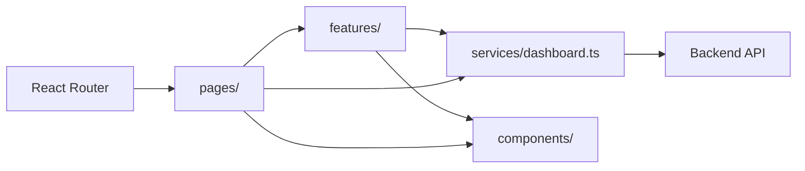

# Resident Energy Dashboard Frontend

React-based frontend for the resident energy analysis workspace. The application provides dataset management, load analysis views, classification and anomaly inspection, forecasting workflows, assistant chat, and report access on top of the backend API.

## Features

- Dataset listing, filtering, upload, and detail views
- Daily, weekly, typical-day, and peak-valley analysis charts
- Consumption behavior classification results and confidence display
- Current-window anomaly detection and reason inspection
- Forecast generation, forecast switching, and forecast summary views
- Dataset-scoped assistant chat with citation and action panels
- Report export and download center

## Tech Stack

| Area | Technology |
| --- | --- |
| Framework | React 19 |
| Language | TypeScript |
| Build Tool | Vite |
| UI Library | Ant Design |
| Routing | React Router |
| Charts | ECharts via `echarts-for-react` |
| HTTP Client | Axios |
| Package Manager | pnpm |

## Requirements

- Node.js compatible with the versions required by Vite 8 and React 19
- pnpm
- A running backend service exposing the `/api/v1` API

The frontend no longer includes a local mock data runtime. All business data is loaded through `src/services/` from the backend API.

## Getting Started

```bash
cd frontend
pnpm install
pnpm dev
```

The development server listens on:

```text
http://127.0.0.1:3000
```

## Scripts

| Command | Description |
| --- | --- |
| `pnpm dev` | Start the Vite development server |
| `pnpm build` | Run TypeScript build and create the production bundle |
| `pnpm lint` | Run ESLint |
| `pnpm preview` | Preview the production build locally |

## Environment Variables

Use `.env.example` as the reference configuration.

| Variable | Default | Description |
| --- | --- | --- |
| `VITE_BACKEND_BASE_URL` | `http://127.0.0.1:5000` | Backend origin used by the Vite development proxy |
| `VITE_API_PREFIX` | `/api/v1` | API prefix used by the Axios client |

During development, Vite proxies `/api` requests to `VITE_BACKEND_BASE_URL`. If the backend runs on another port, update `.env.development`.

## Routing

Route metadata is centralized in `src/app/routeMap.ts`. Runtime route rendering lives in `src/app/routes.tsx`.

| Path | Page | Entry File | Feature Module |
| --- | --- | --- | --- |
| `/` | Redirects to dataset center | `src/app/routes.tsx` | - |
| `/datasets` | Dataset center | `src/pages/DatasetsPage.tsx` | Inline page implementation |
| `/datasets/:datasetId` | Dataset detail | `src/pages/DatasetDetailPage.tsx` | `src/features/dataset-detail/` |
| `/chat` | Assistant chat | `src/pages/ChatPage.tsx` | Inline page implementation |
| `/overview` | Service overview | `src/pages/SettingsPage.tsx` | Inline page implementation |
| `/settings` | Compatibility redirect to overview | `src/app/routes.tsx` | - |
| `/reports` | Report center | `src/pages/ReportsPage.tsx` | Inline page implementation |

## Project Structure

```text
src/
├── app/          App shell, route map, and router configuration
├── components/   Shared charts and reusable UI components
├── constants/    Display labels, colors, and fixed mappings
├── features/     Feature modules for decomposed business workflows
├── pages/        Route-level page entry components
├── services/     Backend API access layer
├── types/        API and domain TypeScript types
├── utils/        Shared formatting and utility functions
├── App.tsx       Root application component
└── main.tsx      React mount entry
```

Recommended navigation path when looking for a page:

```text
src/app/routeMap.ts
  -> src/pages/<PageName>.tsx
  -> src/features/<feature-name>/ when the page has been decomposed
```

## Dataset Detail Feature Module

The dataset detail page is decomposed into `src/features/dataset-detail/`:

```text
src/features/dataset-detail/
├── components/   Analysis, classification, detection, forecast, and report tabs
├── hooks/        Page data loading, UI state, and user-triggered actions
└── model/        Chart mappers, forecast windows, and classification view models
```

`src/pages/DatasetDetailPage.tsx` acts as a composition layer. It reads the route parameter, renders page-level layout, and delegates data orchestration to `hooks/` and pure business transformations to `model/`.

## Data Flow



## Backend Integration

Before running the frontend in development:

1. Start the backend service.
2. Confirm the backend is listening on the URL configured by `VITE_BACKEND_BASE_URL`.
3. Confirm the frontend `VITE_API_PREFIX` matches the backend API prefix, normally `/api/v1`.

The Axios client is configured in `src/services/dashboard.ts`. The Vite development proxy is configured in `vite.config.ts`.

## Development Notes

- Use `pnpm`, not `npm`, for dependency management and scripts.
- Keep route-level components in `src/pages/` thin when possible.
- Put complex page-specific behavior under `src/features/<feature-name>/`.
- Put reusable display components under `src/components/`.
- Put backend API calls under `src/services/`; page components should not hard-code request URLs.
- `dist/` is generated by `pnpm build` and should not be treated as source.
- `node_modules/` is generated by `pnpm install` and should not be committed.

## Verification

Run both checks before submitting frontend changes:

```bash
pnpm lint
pnpm build
```
