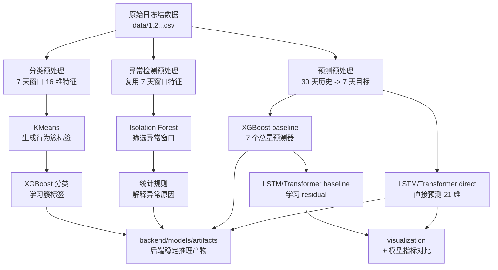

# models 离线建模子项目

`models/` 是本项目的离线建模工程，负责数据预处理、模型训练、模型测试、结果对比和后端推理产物准备。

这个目录和 `backend/` 的职责不同：

- `models/`：训练、实验、评估，产出模型文件和特征配置。
- `backend/`：加载稳定产物，提供接口推理，不直接依赖训练输出目录。

## 运行原则

所有命令默认在 `models/` 目录下执行：

```bash
cd models
uv run python <入口脚本>
```

开发时优先使用各任务目录的 `main.py` 作为运行入口。`train.py`、`test.py` 仍可直接运行，但它们主要是为了兼容已有脚本和方便单独调试。

## 环境

```bash
cd models
uv sync
```

说明：

- Python 版本以 `.python-version` 和 `pyproject.toml` 为准。
- 依赖由 `uv.lock` 锁定。
- XGBoost、KMeans、Isolation Forest、统计规则可在普通 CPU 环境运行。
- LSTM 和 Transformer 训练建议在有 CUDA 的 Linux/Windows 环境运行；macOS 更适合跑预处理、XGBoost 和轻量检查。

## 目录结构

```text
models/
├── main.py                         # 子项目占位入口，不承载具体训练任务
├── data/                           # 原始数据与任务级预处理
│   ├── classification/             # 7 天窗口行为特征
│   ├── forecast/                   # 30 天历史 -> 7 天预测样本
│   ├── detection/                  # 异常检测窗口特征
│   └── export_upload_samples.py    # 后端上传样例导出
├── classification/
│   ├── kmeans/                     # KMeans 无监督聚类
│   └── xgboost/                    # XGBoost 行为分类器
├── detection/
│   ├── isolation_forest/           # 无监督异常检测
│   └── statistical_rules/          # P5/P95、3σ 规则解释
├── forecast/
│   ├── xgboost/                    # XGBoost baseline
│   ├── lstm_baseline/              # LSTM 学习 XGBoost 残差
│   ├── transformer_baseline/       # Transformer 学习 XGBoost 残差
│   ├── lstm/                       # LSTM Direct 直接预测 21 维目标
│   ├── transformer/                # Transformer Direct 直接预测 21 维目标
│   └── visualization/              # 五模型指标对比图
├── pyproject.toml
└── uv.lock
```

## 数据流



## 推荐运行顺序

### 1. 数据预处理

先生成三个任务各自的输入数据。

```bash
uv run python data/classification/preprocess_classification.py
uv run python data/forecast/preprocess_forecast.py
uv run python data/detection/preprocess_detection.py
```

常见输出：

| 脚本 | 主要输出 | 用途 |
| --- | --- | --- |
| `data/classification/preprocess_classification.py` | `data/classification/output/window_features.csv` | KMeans、XGBoost 分类 |
| `data/forecast/preprocess_forecast.py` | `data/forecast/output/forecast_samples_30_to_7.csv` | 预测模型训练 |
| `data/detection/preprocess_detection.py` | `data/detection/output/window_features.csv` | Isolation Forest、统计规则 |

### 2. 分类任务

优先使用 `main.py`：

```bash
uv run python classification/kmeans/main.py
uv run python classification/xgboost/main.py
```

兼容入口仍可用：

```bash
uv run python classification/kmeans/train.py
uv run python classification/xgboost/train.py
```

分类链路是两阶段：

1. `classification/kmeans/main.py`：对 7 天窗口特征做无监督聚类，生成簇标签。
2. `classification/xgboost/main.py`：用 KMeans 标签训练监督分类器，供后端对新窗口快速分类。

### 3. 异常检测任务

```bash
uv run python detection/isolation_forest/main.py
uv run python detection/statistical_rules/run.py
```

说明：

- Isolation Forest 负责筛选疑似异常窗口。
- 统计规则负责解释异常原因，例如 P5/P95 极端值、用户自身 3σ 偏离。
- 如果没有 Isolation Forest 输出，统计规则会分析全量窗口。

### 4. 预测任务

XGBoost baseline：

```bash
uv run python forecast/xgboost/main.py
```

Direct 模型：

```bash
uv run python forecast/lstm/main.py train
uv run python forecast/transformer/main.py train
```

Residual baseline 模型：

```bash
uv run python forecast/lstm_baseline/main.py train
uv run python forecast/transformer_baseline/main.py train
```

测试入口：

```bash
uv run python forecast/lstm/main.py test
uv run python forecast/transformer/main.py test
uv run python forecast/lstm_baseline/main.py test
uv run python forecast/transformer_baseline/main.py test
```

预测模型关系：

| 模型 | 入口 | 目标 |
| --- | --- | --- |
| XGBoost baseline | `forecast/xgboost/main.py` | 通常训练未来 7 天总用电量 |
| LSTM baseline | `forecast/lstm_baseline/main.py` | 学习 `actual - XGBoost baseline` |
| Transformer baseline | `forecast/transformer_baseline/main.py` | 学习 `actual - XGBoost baseline` |
| LSTM Direct | `forecast/lstm/main.py` | 直接预测 21 维：7 总 + 7 峰 + 7 谷 |
| Transformer Direct | `forecast/transformer/main.py` | 直接预测 21 维：7 总 + 7 峰 + 7 谷 |

旧入口 `forecast/xgboost/train_xgboost.py` 只是兼容层，新代码不要继续扩展它。

### 5. 五模型对比图

测试指标生成后，运行：

```bash
uv run python -c "from forecast.visualization.comparison import generate_comparison_figures; generate_comparison_figures()"
```

输出位置：

```text
forecast/comparison/output/
forecast/comparison/output/figures/
```

## 配置约定

每个任务目录通常包含：

```text
config.py
config/default.yaml
data.py
model.py
train.py
test.py
main.py
```

约定：

- `main.py`：命令行入口，负责选择 train/test。
- `config.py`：读取 YAML，解析路径。
- `data.py`：读取数据、切分数据、构造数组。
- `model.py`：模型结构或训练单元。
- `train.py`：训练流程。
- `test.py`：测试、评估、结果写出。

新增模型时优先复用这套结构，不要把路径、训练逻辑、评估逻辑都堆在一个脚本里。

## 常见产物

| 类型 | 常见位置 | 说明 |
| --- | --- | --- |
| 预处理数据 | `data/**/output/` | 任务级中间数据 |
| 训练输出 | `classification/**/output/`、`forecast/**/output/`、`detection/**/output/` | 模型、指标、图表 |
| checkpoint | `forecast/**/output/checkpoints/` | Lightning 或 XGBoost 断点 |
| 日志 | `forecast/**/output/logs/` | 训练日志 |
| 对比图 | `forecast/comparison/output/figures/` | 五模型对比图 |
| 备份 | `_result_backups/` | 历史实验结果备份 |

这些目录通常包含大文件或实验结果，默认不作为源码提交。

## 同步到后端

后端只需要稳定推理产物，不应直接读取 `models/**/output/`。

训练完成后，把后端真正需要的文件同步到：

```text
backend/models/artifacts/
```

当前后端推理重点依赖：

| 后端能力 | 需要的产物 |
| --- | --- |
| 行为分类 | XGBoost 分类模型、LabelEncoder |
| 异常检测 | Isolation Forest 模型、统计规则阈值 |
| 用电预测 | LSTM checkpoint、输入标准化参数、特征列配置 |

同步后需要检查：

```bash
cd backend
uv run python -m compileall -q -f app models config.py main.py
```

## 开发注意事项

- 不要修改原始数据文件；所有任务产物写入对应 `output/`。
- 不要把 `参考/` 或历史结果备份当作主输入。
- 不要在训练脚本里硬编码绝对路径，统一通过配置解析。
- 时间序列预测默认按时间切分，避免未来数据泄漏。
- 用户级分类评估要避免同一用户同时出现在训练集和测试集。
- 后端使用的产物必须有稳定文件名和稳定加载逻辑。
- 新增入口时优先挂到对应目录的 `main.py`，而不是增加新的散落脚本。
